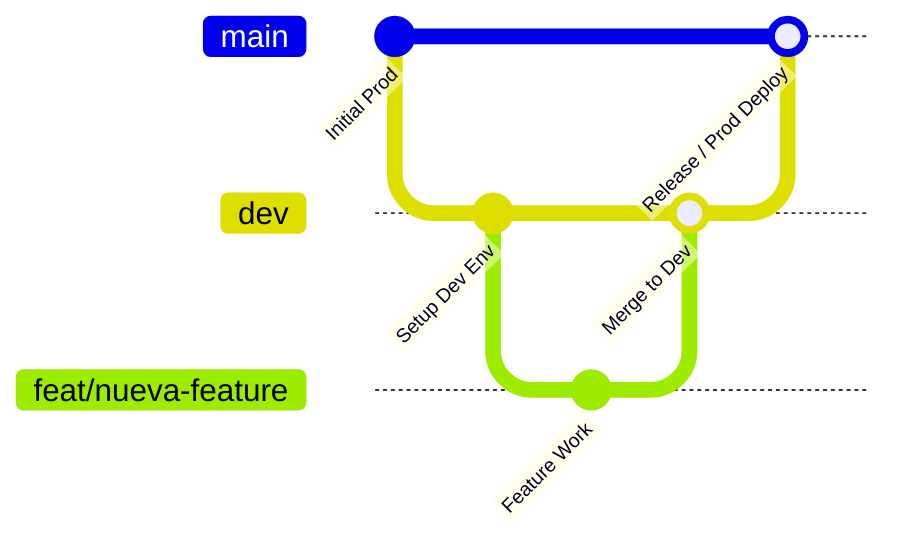

# SPEC-00: Aislamiento de Entornos (Dev vs. Prod) y Estrategia de Ramas Git

> **Estado**: Aprobado / En Implementación  
> **Fecha**: 2026-10-07  
> **Alcance**: Git Workflow, Backend Environment Isolation, Local/Dev Database, Frontend Environment Configuration

---

## 1. Contexto y Problema

Actualmente el proyecto presenta dos riesgos críticos de infraestructura y despliegue:
1. **Flujo Git Centralizado Directo a Producción**: Los cambios y fusiones (*merges*) se realizan directamente sobre la rama `main`, exponiendo el código productivo a regresiones inmediatas.
2. **Base de Datos Única (Producción)**: El entorno local de desarrollo se conecta directamente al cluster de Supabase en producción (`aws-0-us-east-1.pooler.supabase.com`), lo que implica que pruebas locales, migraciones de prueba o limpiezas de datos pueden corromper la base de datos real del negocio.

---

## 2. Estrategia de Ramas Git (GitFlow Simplificado)

> 🛑 **REGLA DE ORO INQUEBRANTABLE (GRABADA EN PIEDRA)**:
> - **CERO ramas desde `main`**: Toda nueva rama (`feat/*`, `fix/*`, `sdd/*`) nace obligatoriamente de `dev`.
> - **CERO merges a `main` sin pasar por `dev`**: Todo desarrollo se integra exclusivamente en `dev`.
> - **`main` es intocable salvo para releases de producción certificados por QA**.

Se adopta el siguiente modelo de ramificación:

1. **`main` (Producción)**:
   - Código auditado, probado y desplegado en los servidores productivos (Vercel / Backend Cloud).
   - Protegida contra commits directos. Solo recibe *pull requests* o *merges* desde `dev` tras validación QA.
2. **`dev` (Integración / Staging)**:
   - Rama principal para el desarrollo activo diario.
   - Aquí se integran las ramas de características (`feat/*`, `fix/*`, `sdd/*`).
   - Apunta exclusivamente a servicios e instancias de base de datos de desarrollo.
3. **`feat/*`, `fix/*` (Trabajo por Tarea)**:
   - Nacen desde `dev` y se reintegran a `dev`.

---

## 3. Arquitectura de Aislamiento de Base de Datos y Variables

### 3.1. Separación de Archivos `.env`
Se implementa una política estricta de archivos de configuración:

| Entorno | Archivo Backend | Archivo Frontend | Destino de Base de Datos |
| :--- | :--- | :--- | :--- |
| **Desarrollo (Local/Dev)** | `backend/.env.development` | `frontend/.env.development` | PostgreSQL Dev (Docker local o Supabase Dev) |
| **Producción (Prod)** | `backend/.env.production` | `frontend/.env.production` | Supabase Producción (`aws-0-us-east-1...`) |
| **Plantillas Versionadas** | `backend/.env.development.example` `backend/.env.production.example` | `frontend/.env.development.example` `frontend/.env.production.example` | Documentadas en Git (sin credenciales reales) |

### 3.2. Infraestructura de Base de Datos Dev
Para garantizar desarrollo 100% aislado:
1. **Docker Compose (`docker-compose.dev.yml`)**:
   - Contenedor PostgreSQL 16 local en puerto `5433` (evitando colisión con cualquier Postgres local en 5432).
   - Base de datos `gnv_manager_dev`, usuario `gnv_dev`, password `gnv_dev_password`.
   - Permite desarrollo offline y pruebas destructivas sin riesgo.
2. **Compatibilidad con Supabase Dev**:
   - Si se cuenta con un segundo proyecto en Supabase (ej. `gnv-manager-staging`), solo se configuran sus cadenas en `backend/.env.development`.

### 3.3. Comandos de Migración de Prisma
- **Desarrollo**: `npm run db:push:dev` o `npm run db:migrate:dev` (actúa solo sobre la DB de Dev).
- **Producción**: `npm run db:migrate:prod` (ejecuta `prisma migrate deploy` exclusivamente en producción bajo CI/CD).
