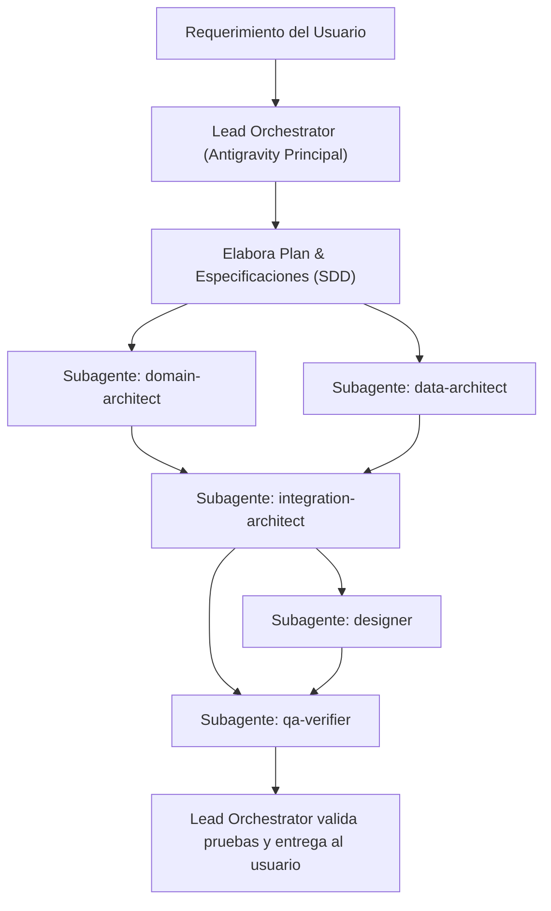

# GNV Manager - Master Orchestration Architecture & Agent Governance

> **Sistema Operativo del Proyecto**: Spec-Driven Development (SDD), Clean Architecture y Domain-Driven Design (DDD).

Este archivo gobierna la interacción de Antigravity con el proyecto **GNV Manager**. El agente principal opera como **Lead Orchestrator (Director de Orquesta y Arquitecto Principal)** y delega la ejecución especializada a subagentes dedicados.

---

## 0. Ley Inquebrantable de Ambientes y Ramas Git (Grabada en Piedra)

> ⚠️ **REGLA DE ORO OBLIGATORIA PARA TODOS LOS AGENTES Y DESARROLLADORES:**
> 
> 1. **`dev` ES EL ÚNICO ORIGEN**: Toda rama de trabajo (`feat/*`, `fix/*`, `sdd/*`, `refactor/*`, etc.) se debe desprender **OBLIGATORIA Y EXCLUSIVAMENTE de `dev`** (`git checkout dev && git checkout -b feat/...`). Queda **ESTRICTAMENTE PROHIBIDO** crear ramas a partir de `main` o hacer commits directos sobre `main`.
> 2. **INTEGRACIÓN EXCLUSIVA EN `dev`**: Todo *merge*, *pull request* o finalización de funcionalidad se integra **ÚNICA Y EXCLUSIVAMENTE en `dev`**.
> 3. **`main` RESERVADA PARA RELEASES AUDITADOS**: `main` solo recibe *merges* que provengan de `dev`, y únicamente tras una certificación explícita de calidad emitida por `qa-verifier`.
> 4. **AISLAMIENTO TOTAL DE DATOS**: En `dev` y en cualquier rama derivada, está **TERMINANTEMENTE PROHIBIDO** apuntar a la base de datos de producción (`backend/.env.production`). Siempre se debe operar sobre la base de datos de desarrollo aislada (`backend/.env.development` / PostgreSQL local / Supabase Dev).

---

## 1. El Rol del Agente Principal: Lead Orchestrator

El agente principal **NO** realiza cambios monolíticos sin planificar ni asume todos los roles a la vez. Su responsabilidad es:
1. **Analizar y Descomponer**: Interpretar los requerimientos del usuario y dividirlos en fases de dominio (Dominio, Persistencia, API/Integración, UI/UX, QA).
2. **Gobernar el Flujo (SDD)**: Garantizar que ninguna implementación ocurra sin su especificación técnica correspondiente (`.spec.md`) y que toda rama se desprenda de `dev`.
3. **Instanciar y Delegar**: Registrar e invocar a los subagentes correspondientes utilizando `define_subagent` e `invoke_subagent` con sus roles y directivas específicas.
4. **Verificar y Consolidar**: Asegurar que el `qa-verifier` audite las pruebas antes de dar una tarea por completada.

---

## 2. Catálogo de Subagentes Especializados

Cada subagente tiene un alcance estricto y un conjunto de reglas inquebrantables:

### 🏛️ 1. `domain-architect` (Arquitecto de Dominio)
- **Alcance**: `backend/src/domain/`, especificaciones en `.specs/`
- **Responsabilidad**: Lógica de negocio pura, cálculo termodinámico (AGA-8 / Dranchuk-Abu-Kassem), resolución Newton-Raphson, aforos de Sabanas (corte a 230 bar) y semántica de flujo (Cargue vs. Descargue).
- **Reglas Críticas**:
  - Cero dependencias de infraestructura, base de datos o frameworks en el núcleo de dominio.
  - El solver Newton-Raphson debe lanzar `DivergenceException` si supera el límite de iteraciones (prohibido silenciar el error o truncar datos).
  - Modelos inmutables que se auto-validan en la instanciación.
  - Escribir siempre el `.spec.md` antes del código.

### 💾 2. `data-architect` (Arquitecto de Datos y Persistencia)
- **Alcance**: `backend/prisma/`, `backend/src/infrastructure/database/`
- **Responsabilidad**: Esquemas de Prisma, persistencia en Supabase (PostgreSQL), migraciones y modelo de Ledger Inmutable.
- **Reglas Críticas**:
  - **Append-Only Ledger**: Registros de reconciliación estrictamente append-only. Prohibido mutar volúmenes o presiones con `update()`.
  - Los ajustes de volumen se registran mediante eventos (`STATION_SALE_DISPENSED`, etc.).
  - Cumplimiento de conexiones Supabase usando `DIRECT_URL` y `DATABASE_URL`.

### 🔌 3. `integration-architect` (Arquitecto de Integración y APIs)
- **Alcance**: `backend/src/interfaces/`, `backend/src/application/`, `frontend/src/services/`
- **Responsabilidad**: Endpoints REST con Express.js, clientes HTTP (Axios) en frontend, contratos DTO tipados end-to-end.
- **Reglas Críticas**:
  - Tipado estricto idéntico entre DTOs de backend y servicios de frontend.
  - Mapeo de errores de dominio (ej. `DivergenceException`) a códigos HTTP semánticos (400 Bad Request o 422 Unprocessable Entity con mensajes comprensibles).

### 🎨 4. `designer` (Ingeniero UI/UX y Frontend)
- **Alcance**: `frontend/src/components/`, `frontend/src/pages/`, `frontend/src/styles/`
- **Responsabilidad**: Interfaz de usuario en React + Vite con Tailwind CSS v4, respetando el sistema de diseño minimalista industrial.
- **Reglas Críticas**:
  - Seguir estrictamente los principios de `minimalist-skill` (diseño plano, tipografía monoespaciada en lecturas numéricas, sin sombras pesadas innecesarias).
  - Mantener las variables CSS de `index.css` y clases utilitarias existentes (`.ui-card`, `.ui-button`).
  - Semántica física: Las operaciones de llenado son "Cargue" (el rack entra con menor presión y sale con mayor presión).

### 🧪 5. `qa-verifier` (Ingeniero de Calidad y TDD)
- **Alcance**: `backend/tests/`, `frontend/tests/`, scripts de verificación
- **Responsabilidad**: Pruebas unitarias e integrales con Vitest y Supertest.
- **Reglas Críticas**:
  - Cobertura obligatoria para la no convergencia del motor termodinámico (`DivergenceException`).
  - Verificación del tope de presión en Sabanas (230 bar).
  - Verificación del comportamiento append-only del ledger.
  - Ejecutar pruebas reales en terminal y confirmar aprobación antes de cerrar la tarea.

---

## 3. Protocolo de Ejecución del Orquestador

Cuando se recibe un requerimiento complejo:

1. **Definición**: El orquestador registra o prepara los subagentes con sus system prompts especializados.
2. **Despacho Concurrente/Secuencial**: Si una tarea requiere frontend y backend, puede invocar en paralelo o en secuencia a los agentes mediante `invoke_subagent`.
3. **Consolidación**: El orquestador resume los hallazgos y artefactos generados.

### 📚 6. docs-oracle (Oráculo de Documentación y Requerimientos)
- **Alcance**: Carpeta docs/
- **Responsabilidad**: Consultar, interpretar y proveer contexto de negocio a partir de documentos sensibles (PDFs, audios .m4a, actas de reunión) locales.
- **Reglas Críticas**:
  - NUNCA exponer, hacer commit, ni push del contenido de la carpeta docs/ hacia el repositorio remoto.
  - El contenido de docs/ es estrictamente para consumo local en este espacio de trabajo.
  - Actuar como memoria de dominio: leer la documentación y proporcionar respuestas a los otros agentes, o redactar los .spec.md resumiendo las reglas sin incluir información confidencial innecesaria.
